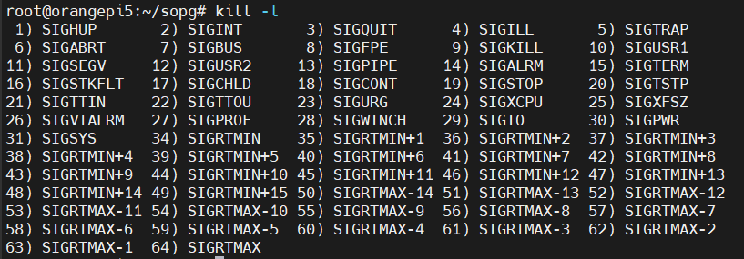
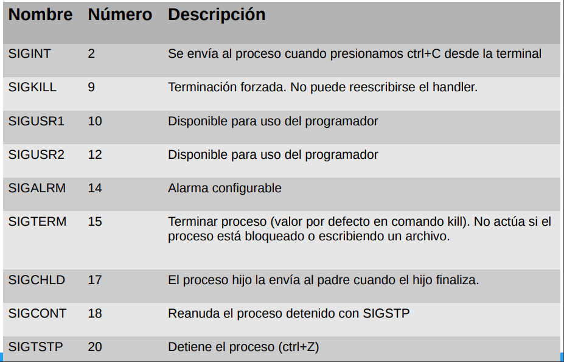
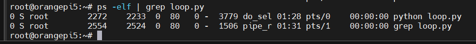
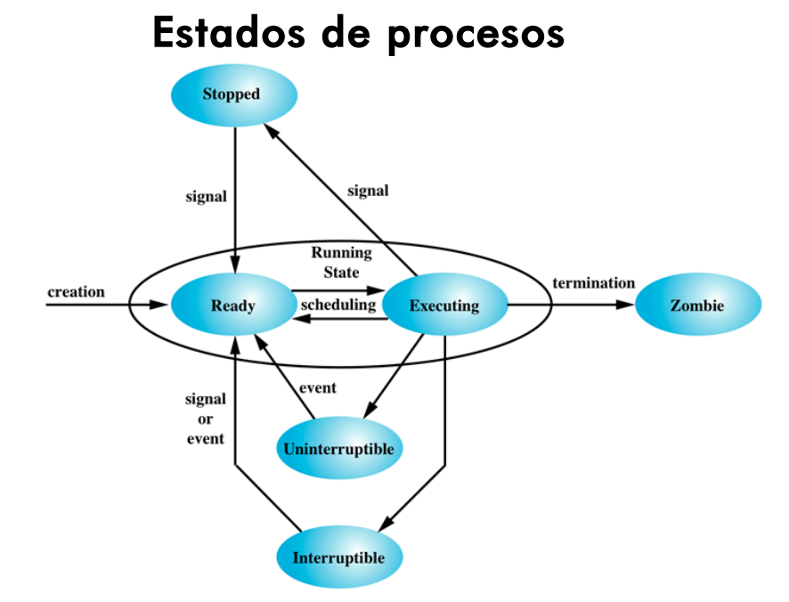
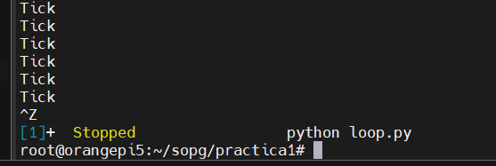
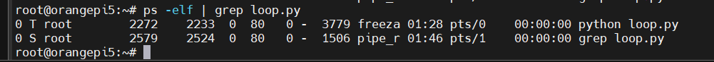
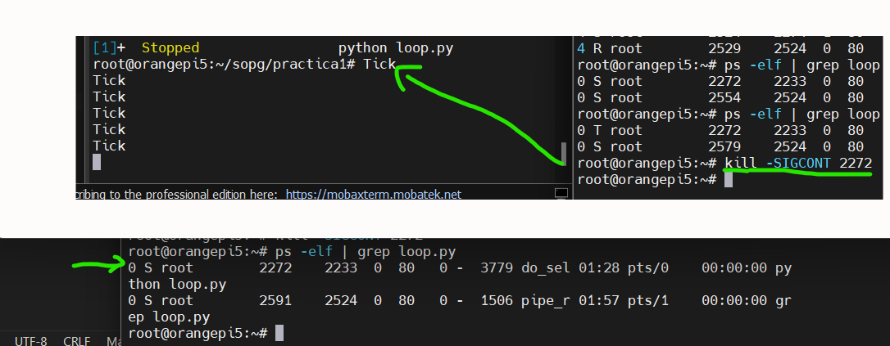
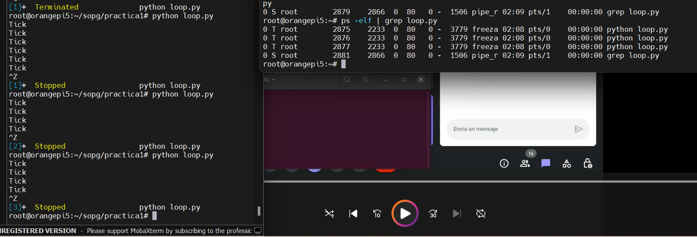
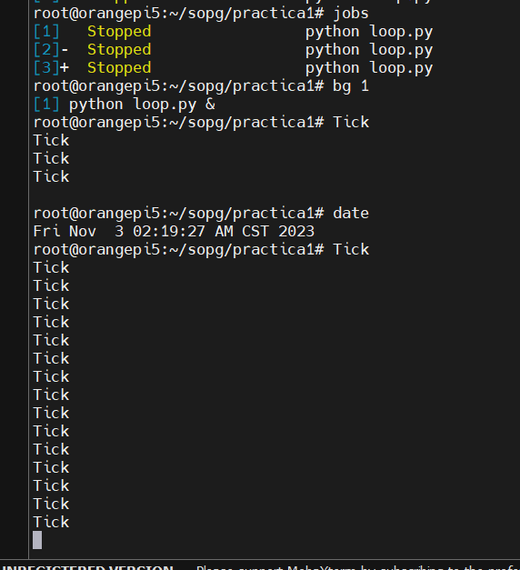
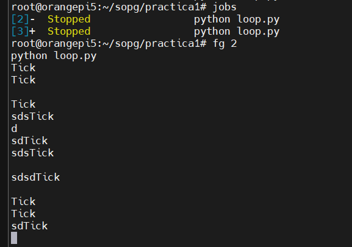

# SistemasOperativoPropositoGeneral

## Clase 3

### Signals (Senales)

Los procesos corren de manera aislada entre si, para intercambiar informacion entre si, se utilizan las signals.

Las signals son un mecanismo simple que nos permite transmitir una senal que es un numero.

Los procesos pueden estar programados para hacer lo que se requiera al recibir estos numeros.

Cuando se recibe un signal, se interrumple el codigo y se ejecutara el Handler del signal, analogo al concepto de interrupciones.

Las senales que se definen en el estandar POSIX se muestran a continuacion: 



Las primeras 32 senales tienen su respectivo nombre y no son de proposito general. No todos los handlers de las senales se pueden reescribir su comportamiento. Por ejemplo, cuando un proceso recibe la senal 9, el proceso se va a terminar, no es posible modificar el handler para que tenga otro comportamiento. 

En el caso de la senal 15, que tambien termina un proceso, si es posible reescribir su handler para que el proceso haga algo antes de que termine.

### Signals RT

Hay otros tipos de senales que se las llaman REAL TIME, todas son de proposito general, a partir de la 34 en adelante. No tienen un nombre en particular.

Estas signals se encolan y se entregan en el orden que llegaron.


Las primeras 32 senales no se encolan, ejemplo:
- Si se recibe la signal 12, se interrumpe el programa, se ejecuta el respectivo handler, y si vuelve a llegar otra signal 12, esta signal va a quedar pendiente, y cuando se termine la funcion del handler, se vovera a ingresar nuevamente a la funcion del handler. Pero si llega 20 veces la signal 12, cuando salga del handler, no se va a llamar 20 veces el handler. Es como si la cola solo tiene espacio para un numero.

### Envio de signal a un proceso

#### Por terminal
En la terminal se utiliza el siguiente comando, donde
- sn: Es el numero del signal
- pid: Es el ID del proceso al que se le envia la signal

```
kill -<sn> <pid>
```

El comando Kill no solo es utilizado para matar un proceso, como se puede pensar.

### Usando la Syscall KILL

En el caso de que se use por codigo, se usa el siguiente prototipo.

```
int kill(pid t pid, int sig);
```

### Signals mas usadas



Ejemplo, en linux cuando un proceso esta colgado, escribimos el comando: kill -9, y el sistema operativo termina este proceso. Es una operacion forzada.

En el caso del SIGTERM, es una manera menos estricta de forzar el cierre de un proceso, se puede especificar que hacer antes de terminarlo, por ejemplo, cerrar un archivo, escribir un log, guardar un log, esto es definido por el usuario, con el objetivo de que no se corrompa el proceso, cerrandolo bruscamente.

Por lo tanto, se recomienda cerrar los procesos con SIGTERM. 
Por default, si enviamos solo el comando Kill, se envia el signal SIGTERM. 

Cuando se preciona Ctrl+C se envia un signal SIGINT, que por defecto tambien cierra un proceso. Pero se puede modificar el Handler para que haga algo mas o otra cosa.

Con Ctrl+Z se envia SIGTSTP, se permite detener un proceso y con SIGCONT se puede reanudar el proceso.

SIGCHILD se usa para enviar que termino el proceso un proceso hijo a su proceso padre. Es aqui cuando el proceso padre envia un wait para terminarlo y no dejarlo en estado zombie.

### Practica 1: Envio de SIGNALS

1) Crear el archivo loop.py que permita imprimir por consola "Tick" cada 1 segundo usando python.

```
import time
while True:
	print("Tick")
	time.sleep(1)
```
2) Ejecutar la lista de procesos activos para ver el estado del mismo y obtener el pid, filtrar el proceso loop.py.
```
ps -elf | grep loop.py
```



Se observa que el estado del proceso es "S" que indica que no se puede interrumpir, pero se lo puede sacar de ese estado enviandole un signal. 



**Porque no esta en running el proceso si el programa se esta ejecutando?** 

Esto sucede por que la mayoria del tiempo se encuentra colgado en el:
```
time.sleep(1)
```

El 99% del tiempo esta en el Sleep y el 1% imprimiendo por consola.

3) Detener el proceso ejecutando Ctrl+Z (Signal SIGSTP):



Al presionar Control+Z se envia el signal al proceso y notamos que ahora el estado del proceso es "T" que significa DETENIDO.



4) Sacarlo del estado detenido a running enviando la signal SIGCONT.
```
kill -SIGCONT 2272
```

El 2272 es el PID de loop.py.

A continuacion, vemos que se reanudo el proceso y ahora paso al estado "S" nuevamente.




**Que pasa si se detiene con Ctrl+Z el proceso y se lo vuelve a ejecutar con python?**

Se crea otro proceso que ejecuta el mismo programa, notamos diferentes process ID.



5) Use comandos: jobs, bg y fg.

El comando **jobs** permite enlistar los procesos en el background.

Si queremos enviar el comando:
```
kill -SIGCONT <pid>
```
Podemos utilizar el comando analogo, donde **num** es el numero que se muestra en la imagen, no esta relacionado con el process ID.
```
bg <num>
```
A continuacion vemos el ejemplo:



El comando bg reanuda el proceso y desconecta la entrada del terminal del proceso, es decir, el estandar input queda conectado al interprete bash linux. En la foto anterior se ve que al escribir **DATE**, el interprete de bash te devuelve una respuesta, es decir, el proceso queda en el background.

Ahora usando el comando **fg** la stin (estandar input) se va a reconectar al proceso, es decir, lo que se escriba va a parar dentro del proceso, ya no se interpretaran los comandos. Es como si el proceso queda en primer plano.



**Observacion:** Cabe recalcar que **fg** y **bg** envian el signal SIGCONT.

