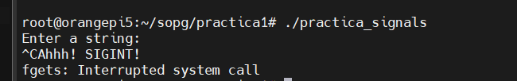

# SistemasOperativoPropositoGeneral

## Clase 3

### Signals (Senales)

Los procesos corren de manera aislada entre si, para intercambiar informacion entre si, se utilizan las signals.

Las signals son un mecanismo simple que nos permite transmitir una senal que es un numero.

Los procesos pueden estar programados para hacer lo que se requiera al recibir estos numeros.

Cuando se recibe un signal, se interrumple el codigo y se ejecutara el Handler del signal, analogo al concepto de interrupciones.

Las senales que se definen en el estandar POSIX se muestran a continuacion: 


Las primeras 32 senales tienen su respectivo nombre y no son de proposito general. No todos los handlers de las senales se pueden reescribir su comportamiento. Por ejemplo, cuando un proceso recibe la senal 9, el proceso se va a terminar, no es posible modificar el handler para que tenga otro comportamiento. 

En el caso de la senal 15, que tambien termina un proceso, si es posible reescribir su handler para que el proceso haga algo antes de que termine.

### Signals RT

Hay otros tipos de senales que se las llaman REAL TIME, todas son de proposito general, a partir de la 34 en adelante. No tienen un nombre en particular.

Estas signals se encolan y se entregan en el orden que llegaron.


Las primeras 32 senales no se encolan, ejemplo:
- Si se recibe la signal 12, se interrumpe el programa, se ejecuta el respectivo handler, y si vuelve a llegar otra signal 12, esta signal va a quedar pendiente, y cuando se termine la funcion del handler, se vovera a ingresar nuevamente a la funcion del handler. Pero si llega 20 veces la signal 12, cuando salga del handler, no se va a llamar 20 veces el handler. Es como si la cola solo tiene espacio para un numero.

### Envio de signal a un proceso

#### Por terminal
En la terminal se utiliza el siguiente comando, donde
- sn: Es el numero del signal
- pid: Es el ID del proceso al que se le envia la signal

```
kill -<sn> <pid>
```

El comando Kill no solo es utilizado para matar un proceso, como se puede pensar.

### Usando la Syscall KILL

En el caso de que se use por codigo, se usa el siguiente prototipo.

```
int kill(pid t pid, int sig);
```

### Signals mas usadas


Ejemplo, en linux cuando un proceso esta colgado, escribimos el comando: kill -9, y el sistema operativo termina este proceso. Es una operacion forzada.

En el caso del SIGTERM, es una manera menos estricta de forzar el cierre de un proceso, se puede especificar que hacer antes de terminarlo, por ejemplo, cerrar un archivo, escribir un log, guardar un log, esto es definido por el usuario, con el objetivo de que no se corrompa el proceso, cerrandolo bruscamente.

Por lo tanto, se recomienda cerrar los procesos con SIGTERM. 
Por default, si enviamos solo el comando Kill, se envia el signal SIGTERM. 

Cuando se preciona Ctrl+C se envia un signal SIGINT, que por defecto tambien cierra un proceso. Pero se puede modificar el Handler para que haga algo mas o otra cosa.

Con Ctrl+Z se envia SIGTSTP, se permite detener un proceso y con SIGCONT se puede reanudar el proceso.

SIGCHILD se usa para enviar que termino el proceso un proceso hijo a su proceso padre. Es aqui cuando el proceso padre envia un wait para terminarlo y no dejarlo en estado zombie.

### Practica 1: Envio de SIGNALS

1) Crear el archivo loop.py que permita imprimir por consola "Tick" cada 1 segundo usando python.

```
import time
while True:
	print("Tick")
	time.sleep(1)
```
2) Ejecutar la lista de procesos activos para ver el estado del mismo y obtener el pid, filtrar el proceso loop.py.
```
ps -elf | grep loop.py
```


Se observa que el estado del proceso es "S" que indica que no se puede interrumpir, pero se lo puede sacar de ese estado enviandole un signal. 


**Porque no esta en running el proceso si el programa se esta ejecutando?** 

Esto sucede por que la mayoria del tiempo se encuentra colgado en el:
```
time.sleep(1)
```

El 99% del tiempo esta en el Sleep y el 1% imprimiendo por consola.

3) Detener el proceso ejecutando Ctrl+Z (Signal SIGSTP):


Al presionar Control+Z se envia el signal al proceso y notamos que ahora el estado del proceso es "T" que significa DETENIDO.


4) Sacarlo del estado detenido a running enviando la signal SIGCONT.
```
kill -SIGCONT 2272
```

El 2272 es el PID de loop.py.

A continuacion, vemos que se reanudo el proceso y ahora paso al estado "S" nuevamente.


**Que pasa si se detiene con Ctrl+Z el proceso y se lo vuelve a ejecutar con python?**

Se crea otro proceso que ejecuta el mismo programa, notamos diferentes process ID.


5) Use comandos: jobs, bg y fg.

El comando **jobs** permite enlistar los procesos en el background.

Si queremos enviar el comando:
```
kill -SIGCONT <pid>
```
Podemos utilizar el comando analogo, donde **num** es el numero que se muestra en la imagen, no esta relacionado con el process ID.
```
bg <num>
```
A continuacion vemos el ejemplo:


El comando bg reanuda el proceso y desconecta la entrada del terminal del proceso, es decir, el estandar input queda conectado al interprete bash linux. En la foto anterior se ve que al escribir **DATE**, el interprete de bash te devuelve una respuesta, es decir, el proceso queda en el background.

Ahora usando el comando **fg** la stin (estandar input) se va a reconectar al proceso, es decir, lo que se escriba va a parar dentro del proceso, ya no se interpretaran los comandos. Es como si el proceso queda en primer plano.


**Observacion:** Cabe recalcar que **fg** y **bg** envian el signal SIGCONT.

### Practica 2: Configurar para que un proceso escuche una signals usando C.

1. Crear un programa que al recibir el signal SIGINT (Ctrl+C), imprima un mensaje y acabe el proceso. Este programa normalmente debe recibir por la terminal un string, que si se ingreso hara un eco de este.

**Funciones utilizadas:**
- **fgets:** fgets() lee una línea de la secuencia especificada y la almacena en la cadena a la que apunta str. Se detiene cuando se leen (n-1) caracteres, se lee el carácter de nueva línea(cuando se presiona enter) o se llega al final del archivo, lo que ocurra primero
	- Sintaxis: 
	```
	char * fgets (char * str , int n , ARCHIVO * flujo );
	```
	- Parametros: 
		- str: puntero a una arreglo de caracteres donde se copia la cadena leída.
		- n: número máximo de caracteres que se copiarán en str (incluido el carácter nulo final).
		- *flujo: puntero a un objeto ARCHIVO que identifica un flujo de entrada. Se puede obtener lectura desde el **stdin** que es la terminal.
		- return: retorna un puntero al string donde la entrada es almacenada. Si da NULL, hay un error. 

- **write:** Se utiliza para escribir datos desde un descriptor de archivo (como un archivo o un descriptor de archivo de socket) a un destino específico. 
	- Sintaxis:
	```
	ssize_t write(int file_descriptor, const void *buffer, size_t count);
	```
	- Parametros:
		- file_descriptor: Este es el descriptor de archivo en el que deseas escribir los datos. Puede ser un archivo, un socket, o cualquier otro tipo de descriptor de archivo. Debes abrir el descriptor de archivo previamente usando la función open o algún otro método adecuado. Al utilizar el 1 en este argumento, estamos especificando que usaremos el descriptor de archivo estándar de salida (STDOUT). En otras palabras, esta llamada escribirá la cadena en la salida estándar, que normalmente es la pantalla.
		- buffer: Un puntero a los datos que deseas escribir en el descriptor de archivo. Estos datos se almacenan en una zona de memoria previamente asignada. El tipo de datos es const void *, lo que significa que se puede utilizar para escribir cualquier tipo de datos.
		- count: La cantidad de bytes que deseas escribir desde el búfer al descriptor de archivo. Especifica el número de bytes que deseas escribir.
		- Valor de retorno: La función write devuelve el número de bytes escritos con éxito si tiene éxito, o -1 en caso de error. Puedes usar el valor de retorno para verificar cuántos bytes se han escrito con éxito en el descriptor de archivo.

- **sigaction:** La función sigaction en C se utiliza para establecer y modificar el manejo de señales (signals) en un programa. Las señales son eventos asincrónicos que pueden ser generados por el sistema operativo o por otros procesos, y son utilizadas para notificar eventos como interrupciones, errores y eventos específicos del sistema.
	- Sintaxis: 
	```
	#include <signal.h>

	int sigaction(int signum, const struct sigaction *act, struct sigaction *oldact);
	```
	- Parametros:
		- signum: Este es el número de la señal que se va a manejar o configurar. Por ejemplo, SIGINT representa la señal de interrupción (como la generada por la combinación de teclas Ctrl+C) y su valor numérico es 2.
		- act: Un puntero a una estructura struct sigaction que contiene la nueva configuración y el manejador de la señal. Puedes especificar cómo deseas que se maneje la señal con esta estructura. Por ejemplo, puedes proporcionar una función que se llame cuando se reciba la señal.
		- oldact: Un puntero a una estructura struct sigaction que almacena la configuración anterior de la señal. Si no estás interesado en la configuración anterior, puedes pasar NULL en lugar de un puntero a una estructura struct sigaction.
		- Valor de retorno: La función sigaction devuelve 0 si se ejecuta con éxito y -1 si ocurre un error. Puedes usar el valor de retorno para verificar si la configuración de la señal se realizó correctamente.

- **perror:** La función perror se utiliza comúnmente después de una llamada a una función que establece la variable errno para imprimir un mensaje de error descriptivo relacionado con la operación fallida.
	- Sintaxis:
	```
	#include <stdio.h>

	void perror(const char *s);
	```
	- Parametros:
		- s: Un puntero a una cadena de caracteres que se utiliza como prefijo para el mensaje de error. Este prefijo se imprimirá antes del mensaje de error. Puedes pasar NULL si no deseas un prefijo.
		- Valor de retorno: La función perror no devuelve ningún valor (tipo de retorno es void). Simplemente imprime el mensaje de error en la salida estándar de error (stderr).

2. Probar el programa, compilamos e ingresamos por la stdin mensajes.


**Observacion:** Hasta este punto se testea el programa y vemos que funciona normalmente. 

3. Enviar la signal SIGINT con control+C.



**Observacion:** Notamos que al presionar Ctrl+C, se llama a una interrupcion del sistema para terminar el proceso, pero antes se imprime o se ejecuta lo que esta dentro del Handler de esta interrupcion, que en este caso es un print de "Ahhh! SIGINT". Notamos tambien que la funcion **perror** entra y nos indica el tipo de error que hubo, que en este caso es "Interrupted systems call".

4. Modifique el programa para que al recibir la SIGINT, no se acabe el proceso.
```
sa.sa_flags = SA_RESTART; //se debe cambiar el campo sa_flags de la estructura sa.
```

**Observacion:** Ahora el llamado de Ctrl+C no acaba el proceso, hemos modificado el comportamiento de esta SIGINT. El proceso acaba cuando se envia el string por la stdin.


