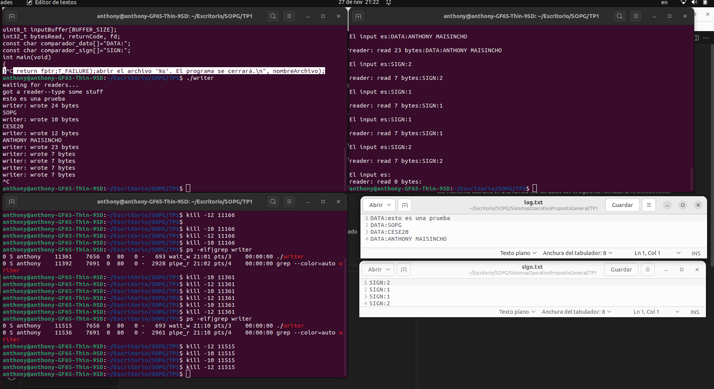

# TRABAJO PRACTICO 1 
## TEMA: NAMED FIFOS AND SIGNALS

### OBJETIVO
Comunicar dos procesos por medio de un named fifo. El proceso Writer podrá recibir texto por la
consola y signals. El proceso Reader deberá loguear en un archivo el texto que recibir el proceso
Writer y en otro archivo las signals que recibe el proceso Writer.

### Partes del sistema:
#### Proceso Writer:
Este proceso iniciará y se quedará esperando que el usuario ingrese texto hasta que presione
ENTER. En ese momento escribirá en una named fifo los datos con el siguiente formato:
DATA:XXXXXXXXX

En cualquier momento el proceso podrá recibir las signals SIGUSR1 y SIGUSR2. En dicho caso
deberá escribir en el named fifo el siguiente mensaje:
SIGN:1 o SIGN:2

#### Proceso Reader:
Este proceso leerá los datos del named fifo y según el encabezado “DATA” o “SIGN” escribirá en el
archivo log.txt o signals.txt.

#### RESULTADOS
Se abre los ejecutables reader y writer previo a las siguientes pruebas:
- Se envio primero mensajes por la terminal.
- Luego se consulto el PID del proceso "writer" para poder enviar los sginals de usuario.
- Se envio los signals 1 y 2.

Observaciones: 
- Es importante manejar el error de fgets(), ya que cuando se atiende un signal, el fgets() se desbloquea y retorna un puntero a null, en mi caso provocaba que el writer formatee el null con un DATA:.
- Se debe utilizar variables especiales al momento de modificar en los handlers del signal, en este caso son del tipo "volatile sig_atomic_t".
